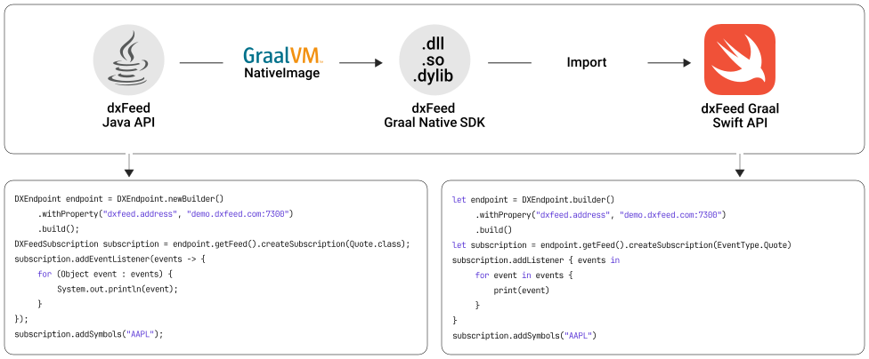

<picture>
 <source media="(prefers-color-scheme: dark)" srcset="docs/images/logo_dark.svg">
 
</picture>

This package provides access to [dxFeed market data](https://dxfeed.com/market-data/).
The library is built as a language-specific wrapper over
the [dxFeed Graal Native](https://dxfeed.jfrog.io/artifactory/maven-open/com/dxfeed/graal-native-api/) library,
which was compiled with [GraalVM Native Image](https://www.graalvm.org/latest/reference-manual/native-image/)
and [dxFeed Java API](https://docs.dxfeed.com/dxfeed/api/overview-summary.html) (our flagman API).


[](https://github.com/dxFeed/dxfeed-graal-swift-api/releases/latest)
[](./Package.swift)
[](./LICENSE)


## Table of Contents

- [Overview](#overview)
    * [Implementation Details](#implementation-details)
- [Documentation](#documentation)
- [Requirements](#requirements)
- [Installation](#installation)
- [Usage](#usage)
    * [How to connect to QD endpoint](#how-to-connect-to-QD-endpoint)
    * [How to connect to dxLink](#how-to-connect-to-dxlink)
- [Tools](#tools)
- [Samples](#samples)
- [Current State](#current-state)

## Overview

dxFeed Graal Swift API allows developers to create efficient applications in Swift language. This enables developers to leverage all the benefits of native app development, resulting in maximum performance and usability for end users.

### Implementation Details

We use [GraalVM Native Image](https://www.graalvm.org/latest/reference-manual/native-image/) technology and specially
written code that *wraps* Java methods into native ones
to get dynamically linked libraries for different platforms (Linux, macOS, and Windows) based on
the [latest Java API package](https://dxfeed.jfrog.io/artifactory/maven-open/com/devexperts/qd/dxfeed-api/).

Then, the resulting dynamic link library (dxFeed Graal-native) is used through
C [ABI](https://en.wikipedia.org/wiki/Application_binary_interface) (application binary interface),
and we write programming interfaces that describe our business model (similar to Java API).

As a result, we get a full-featured, similar performance as with Java API.
Regardless of the language, writing the final application logic using API calls will be very similar (only the syntax
will be amended, *"best practices"*, specific language restrictions)

Below is a scheme of this process:

<picture>
 <source media="(prefers-color-scheme: dark)" srcset="docs/images/scheme_dark.svg">
 
</picture>

## Documentation

Find useful information in our self-service dxFeed Knowledge Base or Swift API documentation:

- [dxFeed Graal Swift API documentation](https://dxfeed.github.io/dxfeed-graal-swift-api/documentation/dxfeedframework/)
- [dxFeed Knowledge Base](https://kb.dxfeed.com/index.html?lang=en)
    * [Getting Started](https://kb.dxfeed.com/en/getting-started.html)
    * [Troubleshooting](https://kb.dxfeed.com/en/troubleshooting-guidelines.html)
    * [Market Events](https://kb.dxfeed.com/en/data-model/dxfeed-api-market-events.html)
    * [Event Delivery contracts](https://kb.dxfeed.com/en/data-model/model-of-event-publishing.html#event-delivery-contracts)
    * [dxFeed API Event classes](https://kb.dxfeed.com/en/data-model/model-of-event-publishing.html#dxfeed-api-event-classes)
    * [Exchange Codes](https://kb.dxfeed.com/en/data-model/exchange-codes.html)
    * [Order Sources](https://kb.dxfeed.com/en/data-model/qd-model-of-market-events.html#order-x)
    * [Order Book reconstruction](https://kb.dxfeed.com/en/data-model/dxfeed-order-book/order-book-reconstruction.html)
    * [Symbology Guide](https://kb.dxfeed.com/en/data-model/symbology-guide.html)

## Requirements

### macOS

| OS                  | Version | Architectures |
|---------------------|---------|---------------|
| [macOS][macOS]      | 10.13+  | x64           |
| [macOS][macOS]      | 11+     | Arm64         |

Is supported in the Rosetta 2 x64 emulator.

[macOS]: https://support.apple.com/macos

### iOS

| OS                  | Version | Architectures |
|---------------------|---------|---------------|
| [iOS][iOS]          | 12+     | Arm64         |
| iOS Simulator       | 12+     | x64, Arm64    |

[iOS]: https://support.apple.com/ios

## Installation

Adding a Dependency  
1. Open your project in Xcode.
2. Select File > Swift Packages > Add Package Dependency…
3. Enter the URL https://github.com/dxFeed/dxfeed-graal-swift-api of the package repository and click Next.
4. Choose the version or branch you want and click Next.
5. Select the target to which you want to add the package and click Finish.

## Usage
### How to connect to QD endpoint
```swift
class Listener: DXEventListener {
    func receiveEvents(_ events: [MarketEvent]) {
        events.forEach {
            print($0.toString())
        }
    }
}

// For token-based authorization, use the following address format:
// "demo.dxfeed.com:7300[login=entitle:token]"
let endpoint = try DXEndpoint.builder().build()
let subscription = try endpoint.getFeed()?.createSubscription(EventCode.quote)
let eventListener = Listener()
try subscription?.add(listener: eventListener)
try subscription?.addSymbols("AAPL")
try endpoint.connect("demo.dxfeed.com:7300")
```

<details>
<summary>Output</summary>
<br>

```
I 231130 124734.411 [main] QD - Using QDS-3.325+file-UNKNOWN, (C) Devexperts
I 231130 124734.415 [main] QD - Using scheme com.dxfeed.api.impl.DXFeedScheme slfwemJduh1J7ibvy9oo8DABTNhNALFQfw0KmE40CMI
I 231130 124734.418 [main] MARS - Started time synchronization tracker using multicast 239.192.51.45:5145 with dPyAu
I 231130 124734.422 [main] MARS - Started JVM self-monitoring
I 231130 124734.423 [main] QD - monitoring with collectors [Ticker, Stream, History]
I 231130 124734.424 [main] QD - monitoring DXEndpoint with dxfeed.address=demo.dxfeed.com:7300
I 231130 124734.425 [main] ClientSocket-Distributor - Starting ClientSocketConnector to demo.dxfeed.com:7300
I 231130 124734.425 [demo.dxfeed.com:7300-Reader] ClientSocketConnector - Resolving IPs for demo.dxfeed.com
I 231130 124734.427 [demo.dxfeed.com:7300-Reader] ClientSocketConnector - Connecting to 208.93.103.170:7300
I 231130 124734.530 [demo.dxfeed.com:7300-Reader] ClientSocketConnector - Connected to 208.93.103.170:7300
D 231130 124734.634 [demo.dxfeed.com:7300-Reader] QD - Distributor received protocol descriptor multiplexor@fFLro [type=qtp, version=QDS-3.319, opt=hs, mars.root=mdd.demo-amazon.multiplexor-demo1] sending [TICKER, STREAM, HISTORY, DATA] from 208.93.103.170
Quote{AAPL, eventTime=0, time=20231130-123206.000, timeNanoPart=0, sequence=0, bidTime=20231130-123206.000, bidExchange=P, bidPrice=189.36, bidSize=3.0, askTime=20231130-123129.000, askExchange=P, askPrice=189.53, askSize=10.0}
```

</details>

### How to connect to dxLink
```swift
class Listener: DXEventListener {
    func receiveEvents(_ events: [MarketEvent]) {
        events.forEach {
            print($0.toString())
        }
    }
}

// The experimental property must be enabled.
try SystemProperty.setProperty("dxfeed.experimental.dxlink.enable", "true")
// Set scheme for dxLink.
try SystemProperty.setProperty("scheme", "ext:opt:sysprops,resource:dxlink.xml")

// For token-based authorization, use the following address format:
// "dxlink:wss://demo.dxfeed.com/dxlink-ws[login=dxlink:token]"
let endpoint = try DXEndpoint.builder().build()
let subscription = try endpoint.getFeed()?.createSubscription(EventCode.quote)
let eventListener = Listener()
try subscription?.add(listener: eventListener)
try subscription?.addSymbols("AAPL")
try endpoint.connect("dxlink:wss://demo.dxfeed.com/dxlink-ws")
```
<details>
<summary>Output</summary>
<br>

```
I 231130 124929.817 [main] QD - Using QDS-3.325+file-UNKNOWN, (C) Devexperts
I 231130 124929.821 [main] QD - Using scheme com.dxfeed.api.impl.DXFeedScheme slfwemJduh1J7ibvy9oo8DABTNhNALFQfw0KmE40CMI
I 231130 124929.824 [main] MARS - Started time synchronization tracker using multicast 239.192.51.45:5145 with sWipb
I 231130 124929.828 [main] MARS - Started JVM self-monitoring
I 231130 124929.828 [main] QD - monitoring with collectors [Ticker, Stream, History]
I 231130 124929.829 [main] QD - monitoring DXEndpoint with dxfeed.address=dxlink:wss://demo.dxfeed.com/dxlink-ws
I 231130 124929.831 [main] DxLinkClientWebSocket-Distributor - Starting DxLinkClientWebSocketConnector to wss://demo.dxfeed.com/dxlink-ws
SLF4J: Failed to load class "org.slf4j.impl.StaticLoggerBinder".
SLF4J: Defaulting to no-operation (NOP) logger implementation
SLF4J: See http://www.slf4j.org/codes.html#StaticLoggerBinder for further details.
I 231130 124929.831 [wss://demo.dxfeed.com/dxlink-ws-Writer] DxLinkClientWebSocket-Distributor - Connecting to wss://demo.dxfeed.com/dxlink-ws
I 231130 124930.153 [wss://demo.dxfeed.com/dxlink-ws-Writer] DxLinkClientWebSocket-Distributor - Connected to wss://demo.dxfeed.com/dxlink-ws
D 231130 124931.269 [oioEventLoopGroup-2-1] QD - Distributor received protocol descriptor [type=dxlink, version=0.1-0.18-20231017-133150, keepaliveTimeout=120, acceptKeepaliveTimeout=5] sending [] from wss://demo.dxfeed.com/dxlink-ws
D 231130 124931.271 [oioEventLoopGroup-2-1] QD - Distributor received protocol descriptor [type=dxlink, version=0.1-0.18-20231017-133150, keepaliveTimeout=120, acceptKeepaliveTimeout=5, authentication=] sending [] from wss://demo.dxfeed.com/dxlink-ws
Quote{AAPL, eventTime=0, time=20231130-123421.000, timeNanoPart=0, sequence=0, bidTime=20231130-123421.000, bidExchange=Q, bidPrice=189.47, bidSize=4.0, askTime=20231130-123421.000, askExchange=P, askPrice=189.53, askSize=10.0}
```

</details>

To familiarize with the dxLink protocol, please click [here](https://demo.dxfeed.com/dxlink-ws/debug/#/protocol).

## Tools

[Tools](./Samples/Tools/)
is a collection of utilities that allow you to subscribe to various market events for the specified symbols. The tools can
be
downloaded
from [Release](https://github.com/dxFeed/dxfeed-graal-swift-api/releases) (tools.zip includes self-contained versions)

* [Connect](./Samples/Tools/ConnectTool.swift)
  connects to the specified address(es) and subscribes to the specified events with the specified symbol
* [Dump](./Samples/Tools/DumpTool.swift)
  dumps all events received from address. This was designed to retrieve data from a file
* [PerfTest](./Samples/Tools/PerfTestTool.swift)
  connects to the specified address(es) and calculates performance counters (events per second, memory usage, CPU usage,
  etc.)
* [LatencyTest](./Samples/Tools/LatencyTestTool.swift)
  connects to the specified address(es) and calculates latency
* [Qds](./Samples/Tools/QdsTool.swift)
  collection of tools ported from the Java qds-tools

To run tools on macOS, it may be necessary to unquarantine them:

```
sudo /usr/bin/xattr -r -d com.apple.quarantine <directory_with_tools>
```

## Samples

- [x] [ConvertTapeFile](./Samples/Playgrounds/ConvertTapeFile.playground/Contents.swift) demonstrates how to convert one tape file to another tape file with optional intermediate processing or filtering
- [x] [DxFeedFileParser](./Samples/Playgrounds/DxFeedFileParser.playground/Contents.swift) is a simple demonstration of how events are read form a tape file
- [x] [DxFeedSample](./Samples/Playgrounds/DxFeedSample.playground/Contents.swift) is a simple demonstration of how to create multiple event listeners and subscribe to `Quote` and `Trade` events
- [x] [PrintQuoteEvents](./Samples/Playgrounds/PrintQuoteEvents.playground/Contents.swift) is a simple demonstration of how to subscribe to the `Quote` event, using a `DxFeed` instance singleton and `dxfeed.properties` file
- [x] [WriteTapeFile](./Samples/Playgrounds/WriteTapeFile.playground/Contents.swift) is a simple demonstration of how to write events to a tape file
- [x] [DxFeedIpfConnect](./Samples/Playgrounds/DxFeedIpfConnect.playground/Contents.swift) is a simple demonstration of how to get Instrument Profiles
- [x] [DXFeedLiveIpfSample](./Samples/Playgrounds/DXFeedLiveIpfSample.playground/Contents.swift)
is a simple demonstration of how to get live updates for Instrument Profiles
- [x] [PublishProfiles](./Samples/Playgrounds/PublishProfiles.playground/Contents.swift) is a simple demonstration of how to publish market events
- [x] [ScheduleSample](./Samples/Playgrounds/ScheduleSample.playground/Contents.swift)
  is a simple demonstration of how to get various scheduling information for instruments
- [x] [FetchDailyCandles](./Samples/Playgrounds/FetchDailyCandles.playground/Contents.swift) is a simple demonstration of how to fetch last N-days of candles for a specified symbol
- [x] [DxFeedReconnectSample](./Samples/Playgrounds/DxFeedReconnectSample.playground/Contents.swift)
  is a simple demonstration of how to connect to an endpoint, subscribe to market data events, handle reconnections 
  and re-subscribing.
- [x] [SimpleAuthSample](./Samples/Playgrounds/SimpleAuthSample.playground/Contents.swift)
  is a simple demonstration of how to connect to endpoint requires authentication token, subscribe to market data events, and handle periodic token updates.

## Current State

### Endpoint Roles

- [x] [FEED](https://dxfeed.github.io/dxfeed-graal-swift-api/documentation/dxfeedframework/dxendpoint/role-swift.enum/feed)
  connects to the remote data feed provider and is optimized for real-time or delayed data processing,
  this is a default role

- [x] [STREAM_FEED](https://dxfeed.github.io/dxfeed-graal-swift-api/documentation/dxfeedframework/dxendpoint/role-swift.enum/streamfeed)
  is similar to `Feed` and also connects to the remote data feed provider but is designed for bulk data parsing from
  files

- [x] [PUBLISHER](https://dxfeed.github.io/dxfeed-graal-swift-api/documentation/dxfeedframework/dxendpoint/role-swift.enum/publisher)
  connects to the remote publisher hub (also known as multiplexor) or creates a publisher on the local host ([WriteTapeFile](./Samples/Playgrounds/WriteTapeFile.playground/Contents.swift))

- [x] [STREAM_PUBLISHER](https://dxfeed.github.io/dxfeed-graal-swift-api/documentation/dxfeedframework/dxendpoint/role-swift.enum/streampublisher)
  is similar to `Publisher` and also connects to the remote publisher hub, but is designed for bulk data publishing


- [x] [LOCAL_HUB](https://dxfeed.github.io/dxfeed-graal-swift-api/documentation/dxfeedframework/dxendpoint/role-swift.enum/localhub)
  is a local hub without the ability to establish network connections. Events published via `Publisher` are delivered to
  local `Feed` only

### Event Types

- [x] [Order](https://dxfeed.github.io/dxfeed-graal-swift-api/documentation/dxfeedframework/order)
  is a snapshot of the full available market depth for a symbol

- [x] [SpreadOrder](https://dxfeed.github.io/dxfeed-graal-swift-api/documentation/dxfeedframework/spreadorder)
  is a snapshot of the full available market depth for all spreads

- [x] [AnalyticOrder](https://dxfeed.github.io/dxfeed-graal-swift-api/documentation/dxfeedframework/analyticorder)
  is an `Order` extension that introduces analytic information, such as adding iceberg-related information to a given
  order

- [x] [Trade](https://dxfeed.github.io/dxfeed-graal-swift-api/documentation/dxfeedframework/trade)
  is a snapshot of the price and size of the last trade during regular trading hours and an overall day volume and day
  turnover

- [x] [TradeETH](https://dxfeed.github.io/dxfeed-graal-swift-api/documentation/dxfeedframework/tradeeth)
  is a snapshot of the price and size of the last trade during extended trading hours and the extended trading hours day
  volume and day turnover

- [x] [Candle](https://dxfeed.github.io/dxfeed-graal-swift-api/documentation/dxfeedframework/candle)
  event with open, high, low, and close prices and other information for a specific period

- [x] [Quote](https://dxfeed.github.io/dxfeed-graal-swift-api/documentation/dxfeedframework/quote)
  is a snapshot of the best bid and ask prices and other fields that change with each quote

- [x] [Profile](https://dxfeed.github.io/dxfeed-graal-swift-api/documentation/dxfeedframework/profile)
  is a snapshot that contains the security instrument description

- [x] [Summary](https://dxfeed.github.io/dxfeed-graal-swift-api/documentation/dxfeedframework/summary)
  is a snapshot of the trading session, including session highs, lows, etc.

- [x] [TimeAndSale](https://dxfeed.github.io/dxfeed-graal-swift-api/documentation/dxfeedframework/timeandsale)
  represents a trade or other market event with price, such as the open/close price of a market, etc.

- [x] [Greeks](https://dxfeed.github.io/dxfeed-graal-swift-api/documentation/dxfeedframework/greeks)
  is a snapshot of the option price, Black-Scholes volatility, and greeks

- [x] [Series](https://dxfeed.github.io/dxfeed-graal-swift-api/documentation/dxfeedframework/series)
  is a snapshot of computed values available for all options series for a given underlying symbol based on options
  market prices

- [x] [TheoPrice](https://dxfeed.github.io/dxfeed-graal-swift-api/documentation/dxfeedframework/theoprice)
  is a snapshot of the theoretical option price computation that is periodically performed
  by [dxPrice](http://www.devexperts.com/en/products/price.html) model-free computation

- [x] [Underlying](https://dxfeed.github.io/dxfeed-graal-swift-api/documentation/dxfeedframework/underlying)
  is a snapshot of computed values available for an option underlying symbol based on the market’s option prices

- [x] [OptionSale](https://dxfeed.github.io/dxfeed-graal-swift-api/documentation/dxfeedframework/optionsale)
  represents a trade or another market event with the price (for example, market open/close price, etc.) for each option
  symbol listed under the specified `Underlying`

- [x] [OtcMarketsOrder](https://dxfeed.github.io/dxfeed-graal-swift-api/documentation/dxfeedframework/otcmarketsorder) represents an
  extension of `Order` for the symbols traded on the OTC Markets

### Subscription Symbols

- [x] String is a string representation of the symbol

- [x] [TimeSeriesSubscriptionSymbol](https://dxfeed.github.io/dxfeed-graal-swift-api/documentation/dxfeedframework/timeseriessubscriptionsymbol)
  represents subscription to time-series events

- [x] [IndexedEventSubscriptionSymbol](https://dxfeed.github.io/dxfeed-graal-swift-api/documentation/dxfeedframework/indexedeventsubscriptionsymbol)
  represents subscription to a specific source of indexed events

- [x] [WildcardSymbol.ALL](https://dxfeed.github.io/dxfeed-graal-swift-api/documentation/dxfeedframework/wildcardsymbol)
  represents a  *wildcard* subscription to all events of the specific event type

- [x] [CandleSymbol](https://dxfeed.github.io/dxfeed-graal-swift-api/documentation/dxfeedframework/candlesymbol)
  is a symbol used with [DXFeedSubscription](https://dxfeed.github.io/dxfeed-graal-swift-api/documentation/dxfeedframework/dxfeedsubscription)
  class to subscribe for [Candle](https://dxfeed.github.io/dxfeed-graal-swift-api/documentation/dxfeedframework/candle) events

### Subscriptions & Models

- [x] [DXFeedSubscription](https://dxfeed.github.io/dxfeed-graal-swift-api/documentation/dxfeedframework/dxfeedsubscription)
  is a subscription for a set of symbols and event types

- [x] [DXFeedTimeSeriesSubscription](https://dxfeed.github.io/dxfeed-graal-swift-api/documentation/dxfeedframework/dxfeedtimeseriessubscription)
  extends `DXFeedSubscription` to conveniently subscribe to time series events for a set of symbols and event types

- [x] [ObservableSubscription](https://dxfeed.github.io/dxfeed-graal-swift-api/documentation/dxfeedframework/iobservablesubscription) is an observable set of subscription symbols for the specific event type

- [x] [GetLastEvent](https://dxfeed.github.io/dxfeed-graal-swift-api/documentation/dxfeedframework/dxfeed/getlastevent(type:symbol:))
  returns the last event for the specified event instance
  ([DxFeedSample](./Samples/Playgrounds/DxFeedSample.playground/Contents.swift))

- [x] [GetLastEvents](https://dxfeed.github.io/dxfeed-graal-swift-api/documentation/dxfeedframework/dxfeed/getlastevents(types:))
  returns the last events for the specified event instances list

### IPF & Schedule

- [x] [InstrumentProfile](https://dxfeed.github.io/dxfeed-graal-swift-api/documentation/dxfeedframework/dxinstrumentprofileconnection)
  represents basic profile information about a market instrument
  ([DXFeedIpfConnect](./Samples/Playgrounds/DxFeedIpfConnect.playground/Contents.swift))

- [x] [InstrumentProfileReader](https://dxfeed.github.io/dxfeed-graal-swift-api/documentation/dxfeedframework/dxinstrumentprofilereader) reads 
  instrument profiles from the stream using Instrument Profile Format (IPF)

- [x] [InstrumentProfileCollector](https://dxfeed.github.io/dxfeed-graal-swift-api/documentation/dxfeedframework/dxinstrumentprofilecollector)
  collects instrument profile updates and provides the live instrument profiles list
  ([DXFeedLiveIpfSample](./Samples/Playgrounds/DXFeedLiveIpfSample.playground/Contents.swift))
 
- [x] [InstrumentProfileConnection](https://dxfeed.github.io/dxfeed-graal-swift-api/documentation/dxfeedframework/dxinstrumentprofileconnection) 
  connects to an instrument profile URL and reads instrument profiles with support of streaming live updates

- [x] [Schedule](https://dxfeed.github.io/dxfeed-graal-swift-api/documentation/dxfeedframework/dxschedule) 
  provides API to retrieve and explore various exchanges’ trading schedules and different financial instrument classes
  ([ScheduleSample](./Samples/Playgrounds/ScheduleSample.playground/Contents.swift))